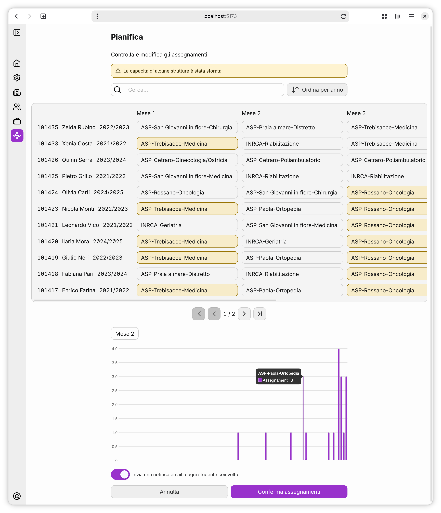

# Tirocinio

This is a web application written in [Svelte](https://svelte.dev/), in order to support planning internships for the Course of Nursing at [Unical](https://unical.it).

## Building

- Running during development: `npm run dev -- --open`.
- Building a production version of the app: `npm run build`. To preview the build use `npm run preview`.

## Deploying with Docker

1. Set up the `.env` file, using [`.env.example`](.env.example) as a starting point.
2. Run `docker compose up -d`. The app will be listening at `http://localhost:3000`.

## Resources

- [Dockerizing Your SvelteKit Applications: A Practical Guide](https://khromov.se/dockerizing-your-sveltekit-applications-a-practical-guide/)
- [A Modern CSS Reset](https://www.joshwcomeau.com/css/custom-css-reset/)
- [System Font Stack](https://systemfontstack.com/)
- [There is No Need to Trap Focus on a Dialog Element](https://css-tricks.com/there-is-no-need-to-trap-focus-on-a-dialog-element/)
- [A Complete CSS Grid Layout Guide](https://css-tricks.com/complete-guide-css-grid-layout/)
